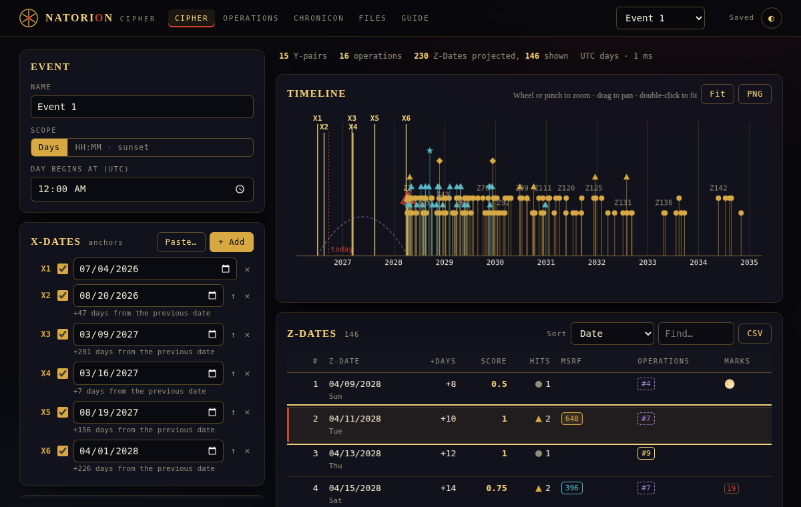
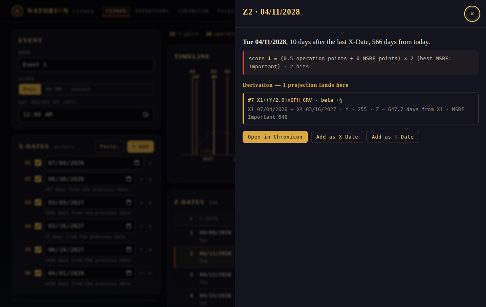
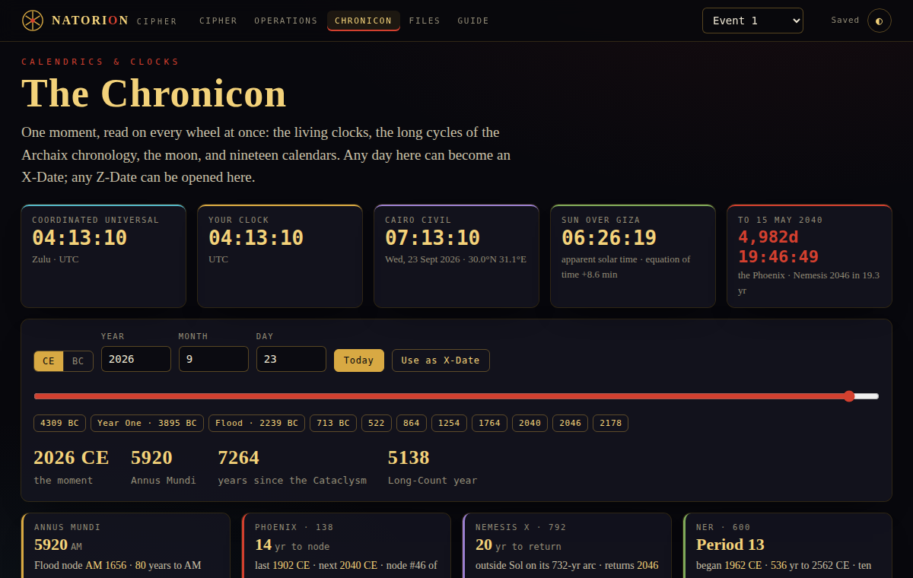

# Natorion Cipher — README for dummies

**Natorion Cipher** is a date-projection tool that runs in your web browser. You give it two or more dates that matter to you; it counts the days between them, runs those counts through sixteen number formulas, and lists the future dates they point to, strongest first. It also includes **the Chronicon**, a page of live clocks, long historical cycles, the moon, and nineteen calendars.

It rebuilds **Ophis v12** (the Windows desktop app also called PSYFR) as a plain web page. Nothing to install, no account, no internet needed after the first open, and nothing leaves your computer.

> The full manual, with every button explained, is in **[MANUAL.md](MANUAL.md)**.



---

## 1. Open it (30 seconds)

1. Find the folder called **`natorion`**.
2. Double-click **`index.html`**.
3. It opens in your browser. That's it.

Works in Chrome, Edge, Firefox and Safari, on a computer, tablet or phone.

**If double-clicking opens a text editor instead:** right-click `index.html` → **Open with** → choose your browser.

**If you have no internet:** it still works. The fancy fonts just fall back to plain ones.

---

## 2. Your first projection (2 minutes)

The app opens with an example already loaded, so you can see results immediately. To make your own:

1. Click **Cipher** at the top (it's the first screen).
2. Under **X-Dates**, change the dates to your own. These are the "anchor" dates — the events you want to project forward from. Put the oldest first.
   - Click **+ Add** for more dates.
   - Or click **Paste…** and paste a list like `07/04/2026, 08/20/2026, 03/09/2027`.
3. Look right. The **Z-Dates** table fills in by itself: every future date the formulas point to.
4. Change **Sort** to **Score** to see the strongest dates first.
5. Click any row to see exactly how that date was worked out.

You need **at least two X-Dates**. With only one, there is nothing to count between.

---

## 3. Reading the results

| Column | What it means |
|---|---|
| **Z-Date** | The projected date. |
| **+Days** | How many days after your last X-Date it falls. |
| **Score** | How strong it is. Higher is stronger. |
| **Hits** | How many different formulas landed on this same day. ● 1 · ▲ 2 · ◆ 3 · ★ 4 or more. |
| **MSRF** | Special numbers the day-count matched (blue = normal, gold = important, red = vortex). Matches multiply the score. |
| **Operations** | Which of the formulas (#1–#16) produced it. Solid = full point, dashed = half point. |
| **Marks** | Extras: ⮌ the date reads the same backwards · **19** / **138** the date is a multiple of 19 or 138 days from today · a moon or eclipse on that day. |

The **Timeline** above the table shows the same thing as a picture: gold lines are your X-Dates, and each Z-Date is a stalk whose height is its score. Scroll to zoom, drag to move, double-click to reset. Click a stalk to see which X-Dates it came from.

---

## 4. Saving your work

- **It saves itself** in your browser as you go ("Saved" at the top right).
- To keep a **file** you can back up or share: **Files → Save .oph**. (Or press **Ctrl+S**.)
- To open a file later, or one from the original Ophis app: **Files → Choose .oph…**, or just drag the file onto the page.
- To get the results into Excel: **Files → Results .xls** or **Results CSV**.

> **Important:** the browser copy lives in *that* browser on *that* computer. Clearing your browser history, or using a private window, can erase it. Save a `.oph` file for anything you care about.

---

## 5. The five screens

| Screen | Use it to… |
|---|---|
| **Cipher** | Enter dates, see and sort the projections. The main screen. |
| **Operations** | See or edit the sixteen formulas, add the ten "extras", test a formula. |
| **Chronicon** | Look at any day in history on every calendar and cycle. Read the Dossier — the written chapters on the Stone, Petrie ↔ Breshears and the 138-faced year. Send a day to your X-Dates, or open a Z-Date here. |
| **Files** | Open, save, export, manage several events, copy settings between them. |
| **Guide** | The short version of how the scoring works. |

---





## 6. Common problems

| You see | Do this |
|---|---|
| "At least 2 X-Dates are required." | Add a second date, and make sure both have their tick box ticked. |
| "X2 must come after X1." | Put your dates in order, oldest first (use the ↑ button). |
| "Every projection was filtered out." | Open **Filters** on the left and untick **Before today** or raise **Beyond N days**. |
| A red formula on the Operations screen | That formula has a typo. Hover over it or read the red message under it. |
| My work disappeared | You were probably in a private window or cleared the browser. Open your last saved `.oph` file. |
| HH:MM mode is slow | It calculates real sunsets for your location, which takes a moment. Days mode is instant. |

---

## 7. For the technical folks

- Pure front end: `index.html` + `css/` + `js/`. No build step, no server, no framework. Works from `file://`.
- The engine re-derives the Ophis v12 source in this repo (`../src`). **`tests/parity.js`** runs the original v12 code and this engine side by side on the sample files and on randomly generated events — Days and HH:MM scope, T-Dates, every filter, disabled and unreadable dates, both scoring systems, all five sorts, extra and duplicate operations, "today" placed inside the date range — comparing every Z-Date, score, hit count, MSRF match and contributing operation. Last runs: **1,003 of 1,003** identical (seed 138) and **403 of 403** (seed 19). The one known class of difference is time-zone *data*: v12 ships 2023 zone rules, the browser's are current, so a place whose rules changed since (Kazakhstan moved to UTC+5 in 2024) shows local times an hour apart in HH:MM scope while the instants and scores still match.
- **`tests/self-check.js`** runs 34 checks without the original source.
- **`tests/browser.js`** drives the real app in headless Chromium: every screen, a known projection with a known score, opening v9 and v12 files, pasting dates, editing operations, the Chronicon bridge and Dossier, the three exports, HH:MM scope, persistence across a reload, the timeline, and phone width with no sideways scrolling. It fails on any script error. Mutation-tested: of 16 deliberate breaks to the app, it catches 15; the sixteenth is a CSS rule that other rules already make redundant.
- Formulas are parsed by a small grammar. They are never executed as code, which closes the code-execution hole in v12's shared `.oph` files. Nothing from a file is ever inserted into the page as HTML.

```bash
cd natorion
npm install && npm run setup:browser   # once: Playwright + Chromium (with system libraries), for the browser test only
npm test                               # self-check + browser test
npm run test:parity                    # original v12 vs rebuild (needs ../src and ../lib)
node tests/browser.js --shots shots/   # browser test, saving a screenshot of every step
```

The app itself needs none of this; `npm` is only for the tests.

Bundled third-party code: [Astronomy Engine](https://github.com/cosinekitty/astronomy) (MIT, sunsets and moon phases) and [tz-lookup](https://github.com/darkskyapp/tz-lookup-oss) (time zone from a map position). The eclipse tables are the NASA-derived ones Ophis shipped.

---

*Ophis is a study instrument after the work of Jason Breshears (Archaix). Natorion rebuilds the software. It does not claim the projections predict anything.*

*Seed the dates · cast the numbers · read what survives — read, cast, seed.*
